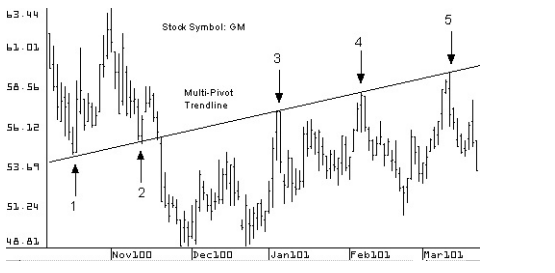
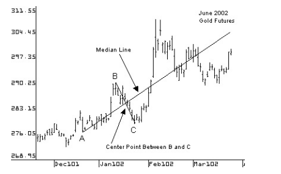

# TreandLine - Andrews Pitchfork

## Gist

### *Multi-Line Pivot*

* greater number of pivots running on trendline has more strength in trendline

### Median Line

* Three points
  * Two points High and Low (B&C)
  * Mid point btw high and low.(A)

### Median Line Theory

* 